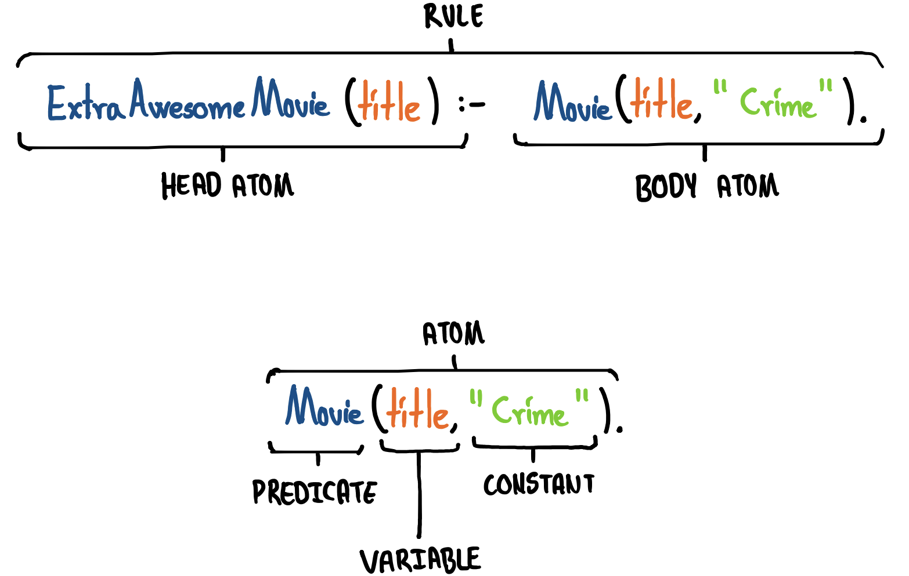

# ProbLog
This system called [ProbLog](https://dtai.cs.kuleuven.be/problog/index.html), for probabilistic Datalog system. In this system, it support both naive and semi-naive evaluation methods, in order to allow measure and compare the efficiency of the naive and semi-naive methods. 

The syntax of a ProbLog rule/fact is basically the same as in the standard [Datalog](https://x775.net/2019/03/18/Introduction-to-Datalog.html)
(that is no negation, no built-in predicates, and no function symbols), 



except that each rule/fact is associated with a real number value v in the range (0, 1], which indicates the probability of the
rule/fact. That is, a rule is an expression of the form:

```
p(X1, ...,Xn) : −q1(Y 1, .., Y i), ...., qk(Z1, ...,Zj) : v1.
```

and a fact is an expression of the form: `q(a1, ..,am) : v2.`

In the above rule and fact, the values v1 and v2 are probabilities of the given rule and fact. The value v1 for instance can be thought of as saying that the probability that "the rule body implies the rule head" is v1. 

For the fact, the value v2 simply indicates the probability of the given fact,that is, the amount of truth in the fact. Note that when the associated values in a program in ProbLog is 1 (and 0), the evaluation results will be identical to standard Datalog programs.
